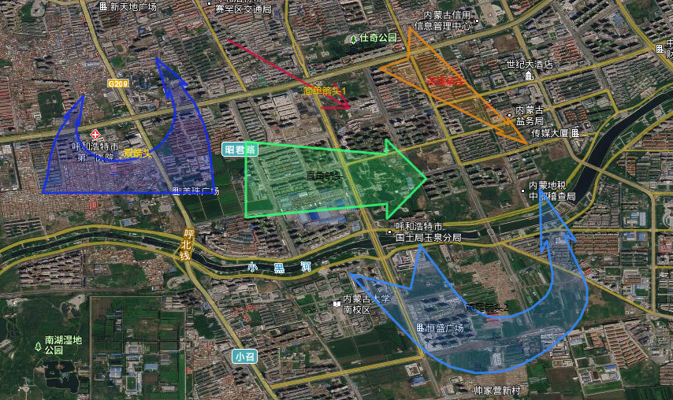

# leaflet-plot

[![NPM Version][npm-image]][npm-url]



### Installation

#### Install via npm

```
npm i leaflet-plot
```

#### Install Manually

Download
[`leaflet-plot.css`](https://unpkg.com/leaflet-plot@1.0.3/dist/leaflet-plot.css) and
[`leaflet-plot.min.js`](https://unpkg.com/leaflet-plot@1.0.3/dist/leaflet-plot.min.js)
and include them in your project.

#### Include via CDN

CSS

<!-- prettier-ignore -->
```html

<link rel="stylesheet" href="https://unpkg.com/leaflet-plot@1.0.3/dist/leaflet-plot.css" />
```

JS

```html
<script src="https://unpkg.com/leaflet-plot@1.0.3/dist/leaflet-plot.min.js"></script>
```

#### Include as ES6 Module

```js
import 'leaflet-plot';
import 'leaflet-plot/dist/leaflet-plot.css';
```

### Getting Started

Currently available shapes are `StraightArrow`, `RightAngleArrow`, `TailedArrow`, `DoubleArrow`.


### Create function

Use Create function on a map like this
```js
// StraightArrow create function
const arrowLayer = window.L.SL.Create.StraightArrow(latlngs, options)

```
##### See the available options.
latlngs: Array<Array<string>>

options: [leaflet path options](https://leafletjs.com/reference-1.4.0.html#path)

### Drawing Mode

Use Drawing Mode on a map like this

```js
// enable StraightArrow drawing mode
map.sl.enableDraw('StraightArrow', options);

// disable drawing mode
map.sl.disableDraw();
```
##### See the available options.

options: [leaflet path options](https://leafletjs.com/reference-1.4.0.html#path)

##### You can listen to map events to hook into the drawing procedure like this:

```js
map.on('sl:create', e => {
  console.log(e);
});
```

| Event        | Params | Description                                                                            |
| :----------- | :----- | :------------------------------------------------------------------------------------- |
| sl:create    | `e`    | Called when a shape is drawn/finished. Payload includes shape type and the drawn layer |

### Edit Mode

Let's you edit vertices of layers. Use it like this:

```js
// enable edit mode
layer.sl.enable();
```

##### You can listen to map events to hook into the drawing procedure like this:

```js
map.on('sl:edit', e => {
  console.log(e);
});
```

| Event        | Params | Description                                                                            |
| :----------- | :----- | :------------------------------------------------------------------------------------- |
| sl:edit            | `e`    | Fired when a layer is edited.                                                                        |

<!-- Markdown link & img dfn's -->
[npm-image]: https://img.shields.io/npm/v/leaflet-plot
[npm-url]: https://www.npmjs.com/package/leaflet-plot